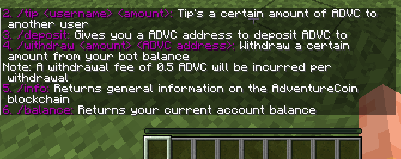
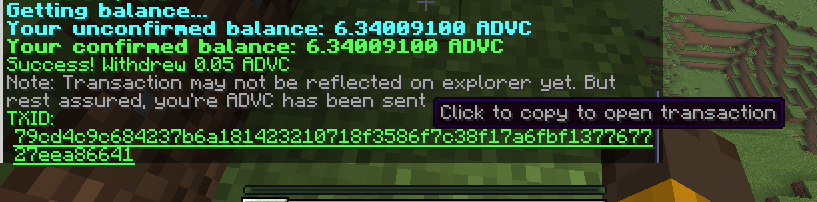

# Crypto-Tipper
A simple Minecraft TipBot for Bitcoin (and bitcoin based coins). Add crypto to your server!

### Commands:
1. /tiphelp: Send's a help message to the user.
2. /balance: Send's the user's balance.
3. /deposit: Returns an address to deposit cryptocurrency into.
4. /withdraw <amount> <address>: Withdraw's a certain amount from the user's account to the specified address.
5. /info: Returns general information about the blockchain network.
6. /tip <username> <amount>: Tip's a certain amount of crypto to a user in the server

### Configuration
Crypto-Tipper provides a `Constants.java` that can be configured to suit your coin's needs.
Whether all the configurations meet your coin's needs is entirely up to you. I have developed
it based on the coin [AdventureCoin](https://adventurecoin.quest/).
However, for the most part, the configuration should be okay for most coins.

### Dependencies used:
```
dependencies {
    compileOnly("org.spigotmc:spigot-api:1.21.8-R0.1-SNAPSHOT")
    implementation("org.postgresql:postgresql:42.7.7")
}
```

### Build
```
./gradlew shadowJar
```
This will compile into a jar file that contains the `postgresql` dependency bundled. The jar
will be built into `build\libs\CryptoTipper-0.1-all.jar`.

### Installing into server
Before running the plugin, ensure that you have the latest spigot server [setup](https://www.spigotmc.org/wiki/buildtools/).
Furthermore, ensure that you have a PostgreSQL instance running, since the plugin will utilise it to
store user information.

Once setup, simply copy the compiled jar file into the plugins folder and reload the server
The plugin should now be enabled and running

Functionality proof:







User 1 balance


After tip

