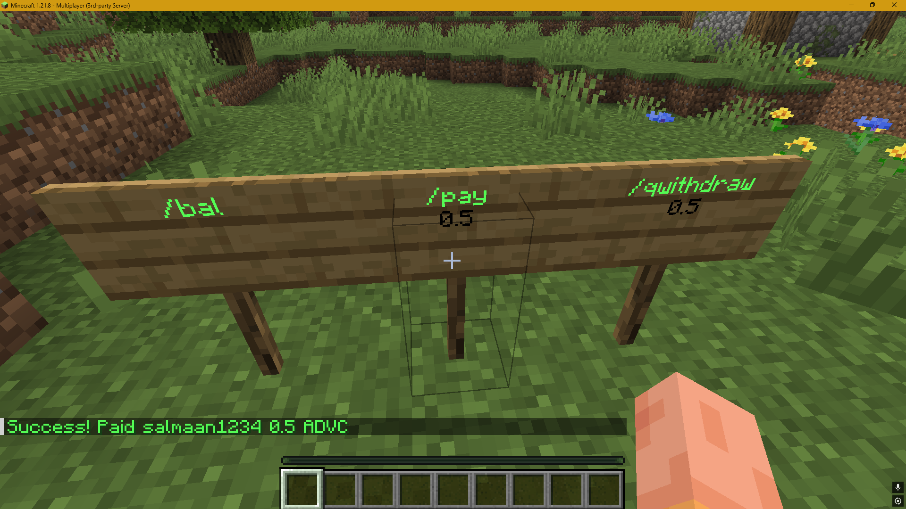
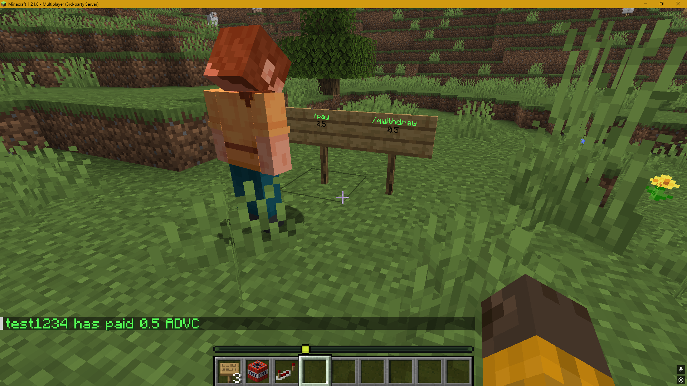

# Crypto-Tipper
A simple Minecraft TipBot for Bitcoin (and bitcoin based coins). Add crypto to your server!

### Commands:
1. /tiphelp: Send's a help message to the user.
2. /balance: Send's the user's balance.
3. /deposit: Returns an address to deposit cryptocurrency into.
4. /withdraw <amount> <address>: Withdraw's a certain amount from the user's account to the specified address.
5. /info: Returns general information about the blockchain network.
6. /tip <username> <amount>: Tip's a certain amount of crypto to a user in the server

### Configuration
Crypto-Tipper provides a `Constants.java` that can be configured to suit your coin's needs.
Whether all the configurations meet your coin's needs is entirely up to you. I have developed
it based on the coin [AdventureCoin](https://adventurecoin.quest/).
However, for the most part, the configuration should be okay for most coins.

### Dependencies used:
```
dependencies {
    compileOnly("org.spigotmc:spigot-api:1.21.8-R0.1-SNAPSHOT")
    implementation("org.postgresql:postgresql:42.7.7")
}
```

### Build
```
./gradlew shadowJar
```
This will compile into a jar file that contains the `postgresql` dependency bundled. The jar
will be built into `build\libs\CryptoTipper-0.1-all.jar`.

### Installing into server
Before running the plugin, ensure that you have the latest spigot server [setup](https://www.spigotmc.org/wiki/buildtools/).
Furthermore, ensure that you have a PostgreSQL instance running, since the plugin will utilise it to
store user information.

Once setup, simply copy the compiled jar file into the plugins folder and reload the server
The plugin should now be enabled and running

## Showcase


User 1 balance


After tip


### Signs functionality
Incorporating this plugin allows users to use signs! There are three commands that the signs can be used for:


- `/bal` -> Get the current user balance
- `/pay <amount>` -> Pays the sign owner a specified amount
- `/qwithdraw <amount>` -> Allows the sign owner to quickly withdraw a specified amount

`/bal`

<br>
`/pay`

<br>

<br>
`/qwithdraw`


### Sign ownership
An important fundamentality of the signs is establishing ownership of who created the sign, who can edit the sign,
who can destroy the sign etc. With this plugin, it is achieved by using the `PersistentDataContainer` of blocks,
where the user ID of the sign creator is stored with the block and is persisted throughout the server, even if it
goes offline. All signs created that inherit a command (such as `/bal`) can only be destroyed/edited by the owner,
but depending on the command it can be used either by the owner or by everyone:

- `/bal` -> Open to all users to use, however cannot be edited/destroyed by anyone. Only the owner
- `/pay` -> Similarly, open to all users except the owner, to enforce that they cannot pay themselves. However, the
owner can edit/destroy the sign
- `/qwithdraw` -> This is only accessible to the owner
